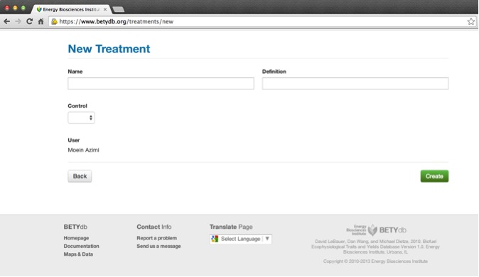

# Adding Treatments and Managements

## [Treatments](https://www.betydb.org/treatments/new)

Treatments provide a description of a study’s
treatments. Any specific information such as rate of fertilizer
application should be recorded in the managements table. In
general, managements are recorded when Yield data is collected, but not
when only Trait data is collected.

**When not to use treatment**: predictor variables that are not based on distinct managements, or that are distinguished by information already contained in the trait (e.g. site, cultivar, date fields) should not be given distinct treatments. For example, a study that compares two different species, cultivars or genotypes can be assigned the same control treatment; these categories will be distinguished by the species or cultivar field. Another example is when the observation is made at two sites: the site field will include this information. 

*  A treatment name is used as a categorical (rather than continuous)
variable: it should be easy to find the treatment in the paper based on
the name in the database. The treatment name does not have to indicate
the level of treatment used in a particular treatment - this information
will be included in the management table.

* It is essential that a control group is identified with each study. If
there is no experimental manipulation, then there is only one treatment. In
this case, the treatment should be named 'observational' and listed as
control. To determine the control when it is not explicitly stated, first
determine if one of the treatments is most like a background condition
or how a system would be in its non-experimental state. In the case of
crops, this could be how a farmer would be most likely to treat a crop.

   **Name**:   indicates type of treatment; it should be easy for anyone with the
    original paper to be able to identify the treatment from its name.   
   **Control**:   make sure to indicate if the treatment is the study 'control' by
    selecting true or false    
   **Definition**:   indicates the specifics of the treatment. It is useful for
    identification purposes to use a quantified description of the
    treatment even though this information can only be used for analysis
    when entered as a management.  

## [Managements](https://www.betydb.org/managements/new) 

**Managements** This is a list of  managements to enter, with the most common management types in bold. It is more important to have management records for Yields than for traits. For greenhouse experiments, it is not necessary to include informaton on fertilizaton, lighting, or greenhouse temperature.

| Management Type | Units | Definition | Notes |
|:----------------|:------|:-----------|:------|
| Burned | aboveground biomass burned |
| CO2 fumigation | ppm | | |
| Fertilization_X      | kg x ha\(^{-1}\) | fertilization rate, element X | | 
| Fungicide | kg x ha\(^{-1}\) |  | add type of fungicide to notes |
| Grazed | years | livestock grazing | pre-experiment land use |
| Harvest | | | no units, just date, equivalent to coppice, aboveground biomass removal |
| Herbicide | kg x ha\(^{-1}\) |   | add type of herbicide to notes: glyphosate, atrazine, many others |
| Irrigation | cm | | convert volume \ area to depth as required |
| Light | W m\(^{-2}\) | | |
| O3 fumigation | ppm | | |
| Pesticide | kg x ha\(^{-1}\) |  | add type of pesticide to notes |
| Planting | plants m\(^{-2}\) |    | Convert row spacing to planting density if possible |
| Seeding  | kg seeds x ha\(^{-1}\) |   |   |
| Tillage | | | no units, maybe depth; *tillage* is equivalent to *cultivate* | 

Managements refers to something that occurs at a specific time and has a
quantity. Managements include actions that are done to a plant or
ecosystem, such as the planting density or rate of fertilization, for example.
Managements are distinct from treatments in that a treatment is used to
categorically identify an experimental treatment, whereas a management
is used to describe what has been done.
Managements are the way a treatment becomes quantified. Each treatment
is often associated with multiple managements. The combination of
managements associated with a particular treatment will distinguish it
from other treatments. The management types that can be entered into
BETY are described in Table \ref{tab:managements}.
Each management may be associated with one or more treatments. For
example, in a fertilization experiment, planting, irrigation, and
herbicide managements would be applied to all plots but the
fertilization will be specific to a treatment. For a multi-year
experiment, there may be multiple entries for the same type of
management, reflecting, for example, repeated applications of herbicide
or fertilizer.

*note:* By default managements are recorded for Yields but not for
Traits, unless specifically required by the data or project manager.

To associate a management with multiple treatments, first create the
management, then edit the management and add treatment relationships.

**Dateloc**:   date level of confidence, explained in Section \ref{sec:traits} and defined in Table \ref{tab:traits}.
**Mgmttype**:   the name of the management being used. A list of standardized
    management types can be found in Table \ref{tab:managements}      
**Level**:   a quantification of mgmttype   
**Units**:   refers to the units of the level. Units should be converted to those
    in  Table \ref{tab:managements}
    
