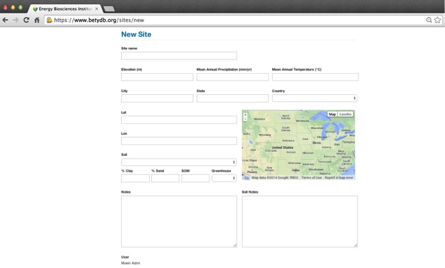

# [Adding a Site](https://www.betydb.org/sites/new)

Each experiment is conducted at a unique site. In the context of BETY,
the term 'site' refers to a specific location and it is common for many
sites to be located within the same experimental station. By creating
distinct records for multiple sites, it is possible to differentiate
among independent studies.

1.  Before adding a site, search to make sure that site is not already
    entered in the database.
2.  Search for the site given latitude and longitude
    -   If an institution name or city and state are given, try to
        locate the site on Google Maps
    -   If a site name is given, try to locate the site using a
        combination of Google and Google Maps
    -   If latitude and longitude are given in the paper, search by lat
        and lon, which will return all sites within $\pm$ 1 degree lat and
        long.
    -   If an existing site is plausibly the same site as the one
        mentioned in the paper, it will be necessary to check other
        papers linked to the existing site.
        -   Use the same site if the previous study uses the *exact same
            location* and experimental setup.
        -   Create a new site if the study was conducted in a different
            field (i.e., not the exact same location).
        -   Create a new site if one study was conducted in a greenhouse
            and another was conducted in a field.
        -   Do not use distinct sites for seed source in a common garden
            experiment (see ’When not to enter a new site’ below)
3.  To use an existing site, click `Edit` for the site, and then select
    current citation under `Add Citation Relationships`
4.  If site does not exist, add a new site.  

Interface for adding a new site:

**Attributes of a site record**

| **Descriptors**              | **Notes** | 
|-----------------------------|-------------------------|
| Site Name |Site identifier, sufficient to uniquely identify the site within the paper |
| City         | Nearest city                 |  
| State           | State, if in the US                |
| Country          |  Country     | 
| Longitude | Decimal Form. For conversion see the equation in table 9 |
| Latitude        | Decimal Form. For conversion see the equation in table 9              |
| Greenhouse        | TRUE if plants were grown in a greenhouse, growth chamber or pots.|
| Soil             |By percent clay, sand, and silt if given               | 
| SOM      |Soil organic matter (% by weight)              | 
| MAT | Mean Annual Temperature (°C) |
| MAP | Mean Annual Percipitation (mm) |
| MASL |Elevation (meters above sea level, m) |
| Notes | Site Details not included above |
| Soil Notes | Soil details not included above |
| Rooting Zone Depth | Measured in Meters (m) |
|Depth of Water Table| Measured in Meters (m) |

5. Do **not** enter a new site When plants (or seeds) are collected from multiple locations   and then grown in the same location, this is called 'common garden experiment'. In this case, the location of the study is included as site information. Information about the seed source can be entered as a distinct cultivar.
 
## Site Location 

Points can be added via the web interface; spatial geometries, e.g. a plot, site, or country boundary, must be entered via the PostgreSQL command line. 

### Point Locations

If latitude and longitude coordinates are not available, it is often
possible to determine the site location based on the site name, city,
and other information. One way to do this would be to look up a location
name in [Google Maps](http://maps.google.com) and then locate it on the
embedded map. Google Maps can provide decimal degrees if the LatLng
feature is enabled, which can be done
[here](http://maps.google.com/maps?showlabs=1). Google Earth can be
particularly useful in locating sites, along with their coordinates and
elevation. Alternatively, the site website or address might be found
through an internet search (e.g. Google).

Use Table \ref{tab:location_accuracy} to determine the number of significant digits to indicate the level of precision with which a study location is known.  

**Table \ref{tab:location_accuracy}** \label{tab:location_accuracy} Level of accuracy to record in lat and lon fields. 
                 
| Location Detail |         Degree Accuracy  |
|:----------------|-------------------------:|
| City            |                      0.1 |
| Mile            |                     0.01 |
| Acre            |                    0.001 |
| 10 Meters       |                   0.0001 |
 
### Boundaries

A vector boundary must be obtained. Here is one way to obtain a site boundary using R:

#### A rectangular plot (with bounding box)

Here I set the bounding box for a plot by specifying the plot corners and elevation. Notice that it is necessary to specify the first point twice, once at the beginning and once at the end. 

    UPDATE sites
    SET geometry = ST_Geomfromtext('POLYGON((-76.116081 42.794448 415, 
                                             -76.116679 42.794448 415, 
                                             -76.116679 42.79231 415, 
                                             -76.116081 42.79231 415,
                                             -76.116081 42.794448 415))', 4326)
    WHERE
        ID = 1123;
    

#### A country boundary:

    library(prevR)# for `create.boundary` function
    library(sp)
    library(rgeos)

    UK_boundary <- create.boundary('United Kingdom')
    writeLines(
      paste("insert into sites (country, sitename, geometry) values ('UK', 'United Kingdom', ST_GEOMFromText('",
             writeWKT(UK_boundary), "',4326)) ;"), con = 'uk.sql')

Then import at the command line (can also copy / paste to terminal, but this boundary is long)

    psql -U bety -d bety < uk.sql

#### References 

* PostGIS `ST_GeomFromText` documentation: http://www.postgis.org/docs/ST_GeomFromText.html
* gis.stackexchange: http://gis.stackexchange.com/q/111212/1239
* Github issues: https://github.com/PecanProject/pecan/issues/570

