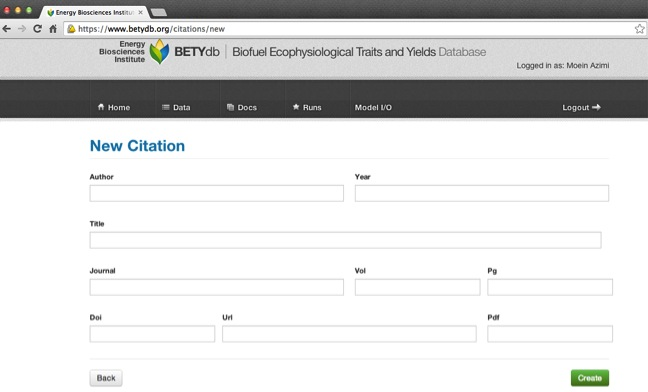

## Adding a Citation

Citation provides information regarding the source of the data. 
A PDF copy of each paper should be available through Mendeley.

1.  Select one of the starred papers from your project's Mendeley folder.
2.  The data to be entered should be specified in the notes associated
    with the paper in Mendeley
3.  Identify (highlight or underline) the data (means and statistics)
    that you will enter
4.  Enter citation information 
    * [Data entry form](https://www.betydb.org/citations/new){target="_blank"} for a new
        site: `BETYdb` → `Citations` → `new`
    *  **Author**: Input the first author’s last name only
    *  **Year**: Input the year the paper was published, not submitted, reviewed,
        or anything else
    *  Fill out Title, Journal, Vol, & Pg. For unknown information, input 'NA'
    *  **DOI**: The 'digital object identifier'. If DOI is available, PDF and
        URL are optional. This can be located in the article or in the
        article website. Use Ctrl+F 'DOI' to find it. Some older
        articles do not have a DOI.
        When entering the DOI, don't include a "doi:" prefix; the DOI should start with "10.".
    *  **URL**: Web address of the article, preferably from publisher's website.  Include the `"http://"` or `"https://"` prefix.  If no on-line version is available, but some other information about how to obtain the citation is available, you may use a parenthesized note in lieu of a bona fide URL, e.g. "(e-mail Dr. No at no@example.com for a written copy)".
    *  **PDF**: URL of the PDF of the article.    Include the `"http://"` or `"https://"` prefix.  (A parenthesized note is allowed here as well.)

