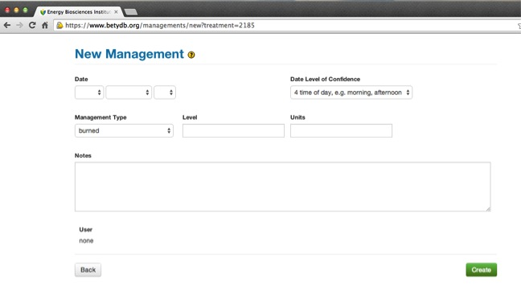

### Adding Managements

There are two ways to add management information, through the web interface or from a spreadsheet. These are discussed in turn, below. Recall that managements can be associated with one or more treatments. 

Managements refers to something that occurs at a specific time and has a quantity.
Managements include actions that are done to a plant or ecosystem, such as the planting density or rate of fertilization, for example.
Managements are distinct from treatments in that a treatment is used to categorically identify an experimental treatment, whereas a management is used to describe what has been done.
Managements are the way a treatment becomes quantified. Each treatment is often associated with multiple managements. 
The combination of managements associated with a particular treatment will distinguish it from other treatments. 
The management types that can be entered into BETY are described in the table below.
Each management may be associated with one or more treatments. 
For example, in a fertilization experiment, planting, irrigation, and herbicide managements would be applied to all plots but the fertilization will be specific to a treatment.
For a multi-year experiment, there may be multiple entries for the same type of management, reflecting, for example, repeated applications of herbicide or fertilizer.

**_Note:_** Managements are not always required and the level of detail depends on the scope of research. By default managements are recorded for Yields but not for Traits, unless specifically required by the data or project manager.

* **Date**: In format `YYYY-MM-DD` or `YYYY-MM-DD HH:MM`.
* **Dateloc**:   Date level of confidence, explained in Section [DateLOC] and the accompanying table.
* **Mgmttype**:   The name of the management being used. A list of standardized
    management types can be found in the table below.
* **Level**:   A quantification of mgmttype.
* **Units**:   Refers to the units of the level. Units should be converted to those
    in following table.
    


#### Types of Managements

The following table shows a list of  managements to enter.  It is more important to have management records for yields than for traits. For greenhouse experiments, it is not necessary to include informaton on fertilizaton, lighting, or greenhouse temperature.

Table: Management Types

| Management Type | Units | Definition     | Notes                   |
|:----------------|:------|:---------------|:------------------------|
| Burned | aboveground biomass burned |
| CO2 fumigation | ppm | | |
| Fertilization_X      | kg x ha\(^{-1}\) | fertilization rate, element X | | 
| Fungicide | kg x ha\(^{-1}\) |  | add type of fungicide to notes |
| Grazed | years | livestock grazing | pre-experiment land use |
| Harvest | | | no units, just date, equivalent to coppice, aboveground biomass removal |
| Herbicide | kg x ha\(^{-1}\) |   | add type of herbicide to notes: glyphosate, atrazine, many others |
| Irrigation | cm | | convert volume \ area to depth as required |
| Light | W m\(^{-2}\) | | |
| O3 fumigation | ppm | | |
| Pesticide | kg x ha\(^{-1}\) |  | add type of pesticide to notes |
| Planting | plants m\(^{-2}\) |    | Convert row spacing to planting density if possible |
| Seeding  | kg seeds x ha\(^{-1}\) |   |   |
| Tillage | | | no units, maybe depth; *tillage* is equivalent to *cultivate* | 


#### Via Web interface


Managements can be entered via the web interface. First enter the management, and then associate it with one or more treatments. To associate a management with multiple treatments, first create the
management, then edit the management and add treatment relationships.





#### Preparing a managements spreadsheet for Upload

When there is a long list of managements, the `insert_managements` scripts enables users to insert data organized in a text based (csv) file.

Preparing the csv file can be done in any spreadsheet program such as Excel or Google Sheets. The insertion is straightforward, but requires familiarity with the bash shell as well as administrative access to the Postgres database.


##### File format {-}

**Required Fields** the spreadsheet or CSV file must contain the following column headings:

	citation_author
	citation_title
	citation_year
	treatment_name
	mgmttype

These columns map to fields in the database (in the citations, treatments, and managements field).
Each row must have non-empty values in each of these columns.  Moreover, the citation columns must match exactly one row in the citations row of the database and the treatment name must match exactly one of the treatment rows associated with the matched citation.

**Optional Fields** The table _may_ also  contain the following column headings:

	date
	dateloc
	level
	units
	notes

Each optional column heading corresponds to an optional field in the database managements table. The column can contain one or more empty rows.

If the table is prepared in a spreadsheet program, use the "save as → .csv" option to export a single text based .csv file. 

#### Inserting Management Insertion Script

The [`insert_managements.rb`](https://github.com/PecanProject/bety/blob/master/script/insert_managements.rb){target="_blank"} script takes a CSV file describing managements to be added to the database as input and outputs a file containing SQL statements to do the required insertions.


The script `insert_managements.rb` is in the directory `RAILS_ROOT/script`.  The complete usage instructions (also obtainable by running `./insert_managements --man`) follow.  For additional information, see [Github issue #288](https://github.com/PecanProject/bety/issues/288#issuecomment-153440839){target="_blank"}.

##### `insert_managements.rb` {-}


```
Usage:
       insert_managements [options] <CSV input file>
where [options] are:
  -u, --login=<s>          The Rails login for the user running the script
                           (required)
  -o, --output=<s>         Output file (default: new_managements.sql)
  -e, --environment=<s>    Rails environment to run in (default: development)
  -m, --man                Show complete usage instructions
  -h, --help               Show this message
```

##### Database Specification {-}

The database used by the script is determined by the environment specified by the '--environment' option (or 'development' if not specified) and the contents of the configuration file 'config/database.yml'.  
(Run 'rake dbconf' to view the contents of this file on the command line.)

##### Using the Script to Update the Production Database {-}

There are three options for using this script to update the production database.

**Option A**: Run the script on the production server in the 
Rails root directory of the production deployment of the BETYdb Rails app.


1. Upload the input CSV file to the production machine.

2. Log in to the production machine and cd to the root directory of production
   deployment of the BETYdb Rails app.

3. Run the script using the '--environment=production' option and with
'--login'
   set to your own BETYdb Rails login for the production deployment.  The
   command-line argument specifying the input CSV file path should match the
   location you uploaded it to.

4. After examining the resulting output file, apply it to the database with the
   command

        psql <production database name>  <  <output file name>

(If your machine login doesn't match a PostgreSQL user name that has insert
permissions on the production database, you will have to use the '-U' option to
specify a user who does have such permission.)


**Option B**: Run the script on your local machine using an up-to-date copy of the BETYdb database.

To do this:

1. Switch to the root of the copy of the BETYdb Rails app you want to use.

2. For the copy of the BETYdb database connected to this copy of the Rails app,
   ensure that at least the citations and the treatments tables are up-to-date
   with the production copy of the BETYdb database.  (If you have different
   databases specified for your development and your production environments,
be
   sure that the environment you specify with the '--environment' option points
   to the right database.)

3. Run this script.

4. Upload the output file to the production server and apply it to the
   production database using the psql command given above.


**Option C**: Run the script on your local machine using a Rails environment connected to the production database.

1. Go to the copy of the BETYdb Rail app on your local machine that you wish to use.
2. Edit the file config/database.yml, adding the following section:
```yaml
ebi:
  adapter: postgis
  encoding: utf8
  reconnect: false
  database: <production database name>
  pool: 5
  username: <user name for connecting to the production database>
  password: <password for the user specified above>
  port: 8000
  host: localhost
```
Most of these values can be copied from the production copy `config/database.yml` if you have access to it.  The port and host entries are 'new'.
3. Set up an ssh tunnel to the production server using the command

        ssh -L 8000:<production server address>:5432 <production server address>
This will log you into the production server, but at the same time it will connect port 8000 on your local machine with port 5432 (the PostgreSQL server port) on the production machine.  (The choice of 8000 for port number is somewhat arbitrary, but whatever value you use should match the value you specified for the port number in the database.yml file.)

4. Run this script with the environment option '--environment=ebi'.  (Again, the name 'ebi' for the environment is somewhat arbitrary, but the option value should match the name in your database.yml file.)
5. Continue as in step 4 under option B.
 

