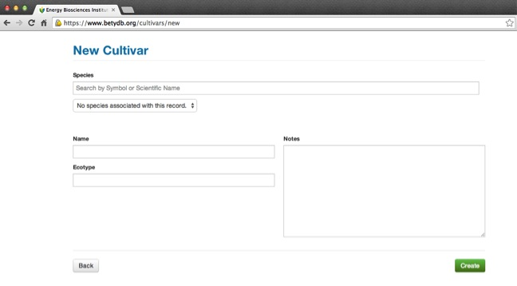

### Adding a PFT, Species, or Cultivar

Plant functional types (PFTs) are used to group plants for statistical
modeling and analysis. PFTs are associated with both a specific set of
priors, and a subset species for which the traits and yields data
will be queried. In many cases, it is appropriate to use default PFTs
(e.g. `tempdecid` is temperate deciduous trees)

In other cases, it is necessary to define PFTs for a specific project.
For example, to query a specific set of priors or a subset of a species, a
new PFT may be defined. For example, Xiaohui Feng defined PFTs for the
species found at the EBI Farm prairie. Such project-specific PFTs can
be defined as `` `projectname`.`pft` `` (i.e. `ebifarm.c4grass` instead
of `c4grass`).

Species that are found or cultivated in the United States should be in
the Plants table. Look it up there first.

To add a new Cultivar, go to the [new
cultivar](https://www.betydb.org/cultivars/new){target="_blank"} page: `Cultivar`
 → `new`.  

